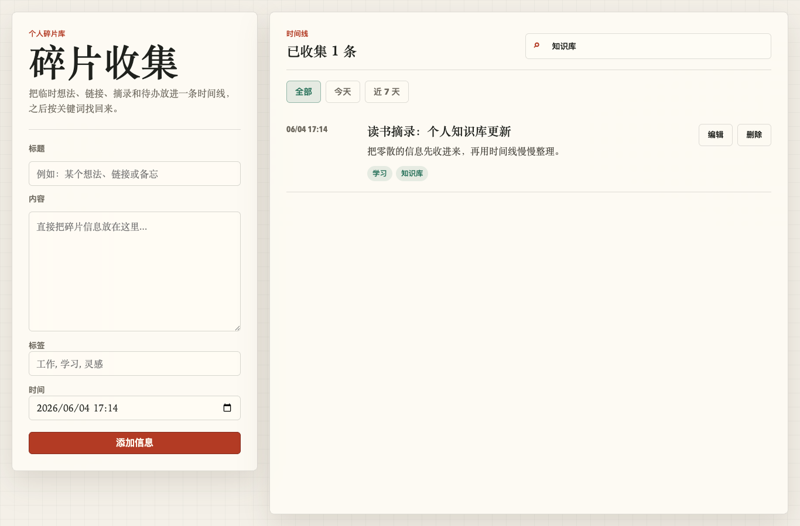
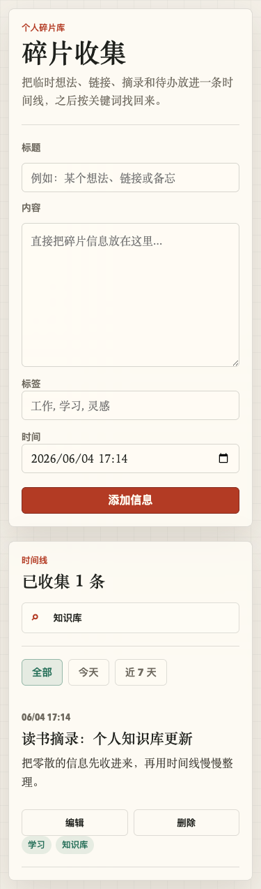

# 碎片收集

一个给个人使用的轻量网页，用来快速收集碎片化信息，并按时间线查看、搜索和管理。

## 功能

- 直接输入内容即可保存，不需要填写标题、标签或时间。
- 支持把剪贴板里的图片直接粘贴到输入框中保存。
- 按卡片流展示历史信息。
- 支持搜索内容。
- 支持从内容里的 `#标签` 自动识别标签，并在左侧标签栏筛选。
- 每条记录右侧提供 `...` 操作入口，可编辑和删除已保存的信息。
- 支持一键导出 Excel，导出字段为分类、日期、内容。
- 支持导出和导入 JSON 备份，用于迁移或恢复当前浏览器里的全部数据。
- 数据保存在当前浏览器本地，不依赖服务器和数据库。

## 预览





## 文件结构

```text
.
├── index.html
├── styles.css
├── app.js
├── preview-desktop.png
└── preview-mobile.png
```

## 本地使用

最简单的方式是直接用浏览器打开 `index.html`。

也可以启动一个本地静态服务：

```bash
python3 -m http.server 4173
```

然后访问：

```text
http://localhost:4173
```

## 部署

这是一个纯静态网站，可以部署到 GitHub Pages、Netlify、Vercel 或任意支持静态文件托管的服务器。

日常修改后更新到 GitHub 的操作流程见：[网站调整后更新到 GitHub 流程](./docs/update-github-flow.md)。

每次功能和界面调整记录见：[变更记录](./docs/change-log.md)。

如果需要撤回某次调整，操作步骤见：[回滚指南](./docs/rollback-guide.md)。

### GitHub Pages

1. 把本项目上传到 GitHub 仓库。
2. 打开仓库的 `Settings`。
3. 进入 `Pages`。
4. Source 选择 `Deploy from a branch`。
5. Branch 选择 `main`，目录选择 `/root`。
6. 保存后等待 GitHub 生成访问地址。

### 自己的服务器

把项目文件上传到服务器静态目录，例如：

```text
/var/www/pages_shouji
```

Nginx 配置示例：

```nginx
server {
    listen 80;
    server_name your-domain.com;

    root /var/www/pages_shouji;
    index index.html;

    location / {
        try_files $uri $uri/ /index.html;
    }
}
```

## 数据说明

当前版本使用浏览器的 `localStorage` 保存数据。

这意味着：

- 数据只保存在当前浏览器里。
- 换电脑、换浏览器后，看不到之前保存的信息。
- 清理浏览器数据可能会删除已保存的信息。
- 如果部署到公网，其他访问者看到的是他们自己浏览器里的本地数据。

建议定期使用页面里的“导出备份”保存 JSON 文件。需要换浏览器、换电脑或恢复数据时，可以用“导入备份”把 JSON 文件里的内容恢复到当前浏览器。

如果需要多设备同步、登录或云端存储，可以在后续版本中增加后端和数据库。

## 技术栈

- HTML
- CSS
- JavaScript
- localStorage

## License

仅供个人使用。需要开源时可自行补充许可证。
